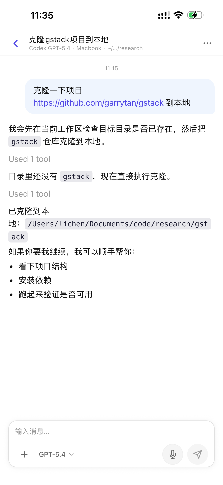
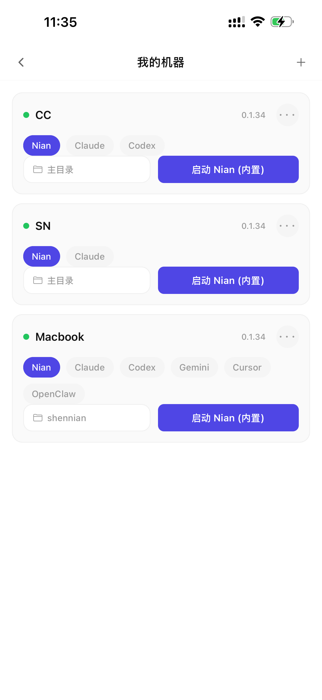
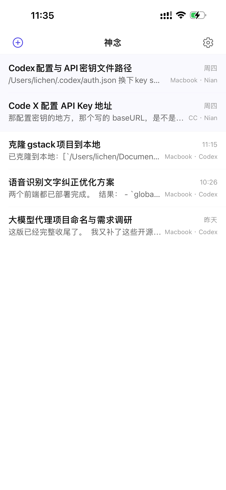
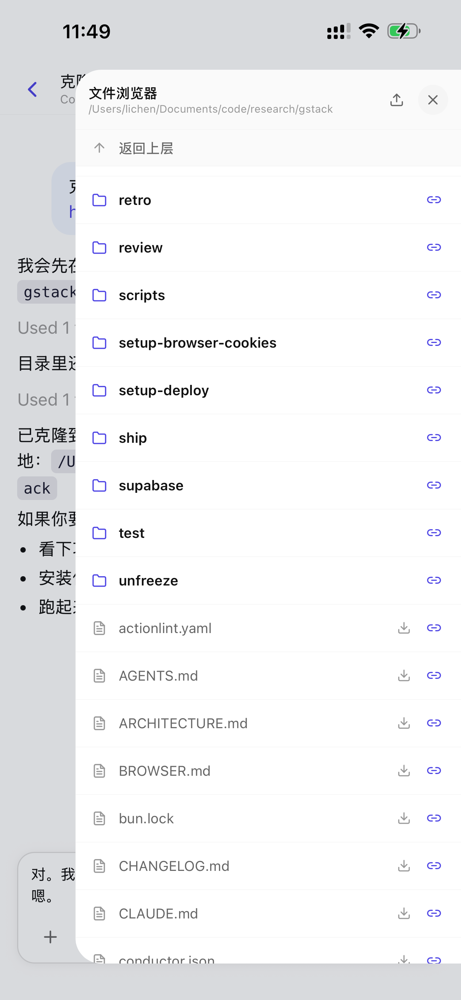
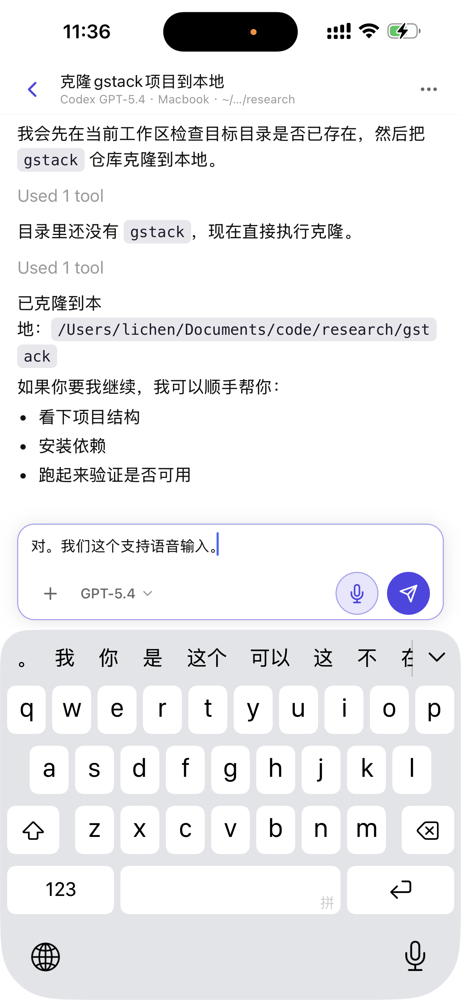

# Shennian — Your AI Agent, Anywhere You Go

> Wherever your phone goes, the agent on your computer comes with you — no desk required.

[中文文档](./README.zh.md) · [Protocol Spec](./PROTOCOL.md) · [shennian.ai](https://shennian.ai) · [shennian.net](https://shennian.net)

<p align="center">
  
</p>

Shennian turns every computer you already own into something you can drive from your pocket. Run `shennian` on a machine, pair your phone once, and from then on Claude Code, Codex, Gemini, Cursor, and any custom agent you plug in all become one tap away — from the café, the subway, the kitchen, or bed.

The agent still runs on **your** computer. Shennian is the bridge, not the compute.

```bash
npm install -g shennian
shennian
```

```
✓ Shennian v0.1.0 starting...
✓ Connected to relay: shennian.ai
◉ Scan QR or enter token to pair
  Token: sn-a3f9...
```

---

## Why Shennian

**A workstation you don't have to sit at.**
Your desktop is already where your code, credentials, and environments live. Shennian lets that machine answer the phone. Spin up a session from anywhere; the agent continues running on your hardware, reading your files, hitting your APIs, using your SSH keys.

**Not another cloud IDE.**
No code upload, no port forwarding, no VPN, no "please enable inbound rules." The CLI opens an outbound relay connection; everything stays local.

**One console, every agent.**
Claude Code, Codex, Gemini CLI, Cursor Agent, OpenClaw, the built-in Nian agent, and any custom protocol-compliant agent share the same phone UI, the same session list, the same push notifications.

---

## Core Capabilities

### Popular agents, zero config
Shennian auto-detects the agents already installed on your machine and exposes them on your phone. No per-agent integration, no configuration file to babysit.

| Agent | How to install on your machine |
|---|---|
| [Claude Code](https://claude.ai/code) | `npm install -g @anthropic-ai/claude-code` |
| [Codex](https://github.com/openai/codex) | `npm install -g @openai/codex` |
| [Gemini CLI](https://github.com/google-gemini/gemini-cli) | `npm install -g @google/gemini-cli` |
| [Cursor Agent](https://cursor.com) | Installed with Cursor |
| [OpenClaw](https://openclaw.com) | Shennian detects the local gateway |
| Nian (built in) | Ships with the CLI — no API key required |

### Every machine is your workstation
Mac at home, desktop at the office, beefy GPU box in the closet, rented cloud VM — anything with `shennian` installed shows up in the same machine list. Flip between them on your phone like switching apps. Agents execute **on the machine**, not in a sandbox.

<p align="center">
  
  
</p>

### Bring your own agent
Any program that reads stdin and writes JSONL to stdout can become a Shennian agent. Implement `/caps` and `/run`, register with `shennian agent add`, and your agent inherits the relay, mobile UI, session persistence, and push notifications for free.

See [Custom Agent Protocol](#custom-agent-protocol) below.

### Remote file browser
Walk that computer's filesystem from your phone — tree view, file preview, upload/download, switch working directories for an agent session on the fly. No SSH, no iCloud round-trip.

<p align="center">
  
</p>

### Voice that actually works
More than speech-to-text. The onboard model polishes sloppy speech into executable prompts and learns your jargon, so you can drive an agent while walking.

<p align="center">
  
</p>

### Push when it's done
Cron, hook, or long-running agent task — Shennian pushes to your phone when it finishes. Close the app, walk away, come back when the dot turns green.

### Machine sharing, on your terms
Issue a time-boxed, permission-scoped invitation. A teammate or client gets temporary access to a specific machine without ever seeing your credentials. Revoke with one tap.

### Everywhere you already are
iOS, Android, and Web clients, built from the same codebase, synced by the same account. Start a session on the couch, keep typing from your laptop.

---

## Get Started

### 1. Install on your computer
```bash
npm install -g shennian
shennian
```
Requires Node.js ≥ 18. The command pairs the machine and starts the background daemon.

### 2. Install the app or open the Web
- iOS — [TestFlight](https://testflight.apple.com/join/shennian) *(beta)*
- Android — [APK download](https://shennian.ai/download)
- Web — [shennian.ai](https://shennian.ai) (global) · [shennian.net](https://shennian.net) (China)

### 3. Scan to pair, start using
The CLI prints a QR code. Scan once and you are paired for good — opening the app is enough from then on.

---

## Custom Agent Protocol

Shennian ships with popular agents, but the real superpower is **your agent**. The protocol is intentionally tiny: a CLI program that speaks stdin/stdout in JSONL.

```
Phone / Browser ←→ Shennian Cloud ←→ Shennian CLI ←→ stdin/stdout ←→ Your Agent
```

### What your agent must implement
- `/caps` — describe `name`, `model`, `models`, `defaultModel`, `mode`, `resume`
- `/run` — read user text from stdin, emit JSONL events to stdout
- `--resume <id>` — for real multi-turn continuity
- `--model <id>` — if you expose multiple models in the UI

### Zero-SDK demos you can copy

The public examples in this repo are the recommended starting point:

- Node: [examples/node/agent.mjs](./examples/node/agent.mjs)
- Python: [examples/python/agent.py](./examples/python/agent.py)

Both demos are plain Node.js / plain Python, no Shennian SDK, wired to the DeepSeek OpenAI-compatible API, with local-file `resume` and multi-model (`deepseek-chat`, `deepseek-reasoner`) exposure.

#### Node demo
```bash
cp examples/node/.env.example examples/node/.env
# fill LLM_API_KEY in examples/node/.env

shennian agent add demo-node --command "node $(pwd)/examples/node/agent.mjs"
shennian agent list
```

```javascript
const supportedModels = ['sonnet-4', 'gpt-4.1']

if (command === '/caps') {
  emit({
    name: 'My Demo Agent',
    model: 'sonnet-4',
    models: supportedModels,
    defaultModel: 'sonnet-4',
    mode: 'spawn',
    resume: true,
  })
}

if (command === '/run') {
  const agentSessionId = args.resumeId || args.sessionId || randomUUID()
  const history = loadSessionMessages('.sessions', agentSessionId)
  const userText = await readStdin()
  const messages = [
    { role: 'system', content: 'You are a helpful coding agent.' },
    ...history,
    { role: 'user', content: userText },
  ]

  const reply = await callYourModelProvider({
    apiKey: process.env.LLM_API_KEY,
    baseUrl: 'https://api.example.com/v1',
    model: args.modelId || 'sonnet-4',
    messages,
  })

  saveSessionMessages('.sessions', agentSessionId, [
    ...history,
    { role: 'user', content: userText },
    { role: 'assistant', content: reply.text },
  ])

  emit({ state: 'delta', text: reply.text })
  emit({ state: 'final', usage: reply.usage, agentSessionId })
}
```

#### Python demo
```bash
cp examples/python/.env.example examples/python/.env
# fill LLM_API_KEY in examples/python/.env

shennian agent add demo-python --command "python3 $(pwd)/examples/python/agent.py"
shennian agent list
```

```python
def caps() -> None:
    emit(
        {
            "name": "My Demo Agent",
            "model": "sonnet-4",
            "models": ["sonnet-4", "gpt-4.1"],
            "defaultModel": "sonnet-4",
            "mode": "spawn",
            "resume": True,
        }
    )

def run(workdir: str, session: str | None, resume: str | None, model: str | None, attachments: list[str]) -> None:
    agent_session_id = resume or session or str(uuid.uuid4())
    history = load_session_messages(".sessions", agent_session_id)
    user_text = sys.stdin.read().strip()
    messages = [{"role": "system", "content": "You are a helpful coding agent."}, *history, {"role": "user", "content": user_text}]
    reply_text, usage = call_model_provider(
        api_key=os.environ["LLM_API_KEY"],
        base_url="https://api.example.com/v1",
        model=model or "sonnet-4",
        messages=messages,
    )
    save_session_messages(
        ".sessions",
        agent_session_id,
        [*history, {"role": "user", "content": user_text}, {"role": "assistant", "content": reply_text}],
    )
    emit({"state": "delta", "text": reply_text})
    emit({"state": "final", "usage": usage, "agentSessionId": agent_session_id})
```

### Register, use, and remove
```bash
shennian agent add demo-node --command "node /abs/path/to/examples/node/agent.mjs"
shennian agent add demo-python --command "python3 /abs/path/to/examples/python/agent.py"

shennian agent list

shennian agent remove demo-node
shennian agent remove demo-python
```

After `agent add`, the agent appears in Shennian as `custom:demo-node` or `custom:demo-python`. Select it, chat normally, send a second turn, keep resuming — the demo stores its own session state and returns `agentSessionId` on every `final`.

Full protocol specification: **[PROTOCOL.md](./PROTOCOL.md)**

---

## SDKs

SDKs are optional. Use them only if you want helpers instead of writing the protocol yourself.

| Language | Package |
|---|---|
| Node.js | `npm install @shennian/agent` |
| Python | `pip install shennian-agent` |

## More examples

Zero-dependency examples, no SDK required:

| Language | Source |
|---|---|
| Node.js | [examples/node/hello-spawn.mjs](./examples/node/hello-spawn.mjs) |
| Python | [examples/python/agent.py](./examples/python/agent.py) |
| Bash | [examples/bash/agent.sh](./examples/bash/agent.sh) |

---

## License

Protocol specification, SDKs, and examples are released under the [MIT License](./LICENSE).
